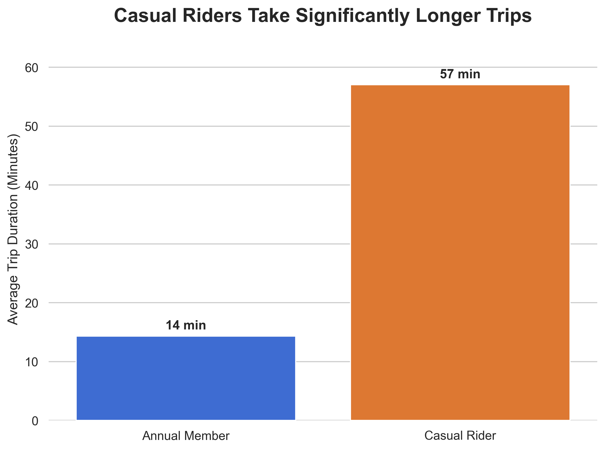
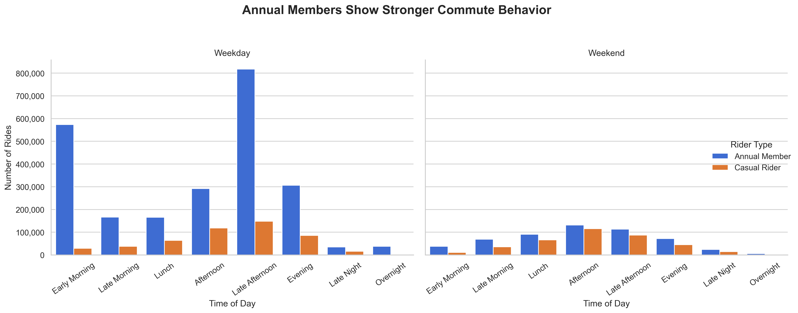
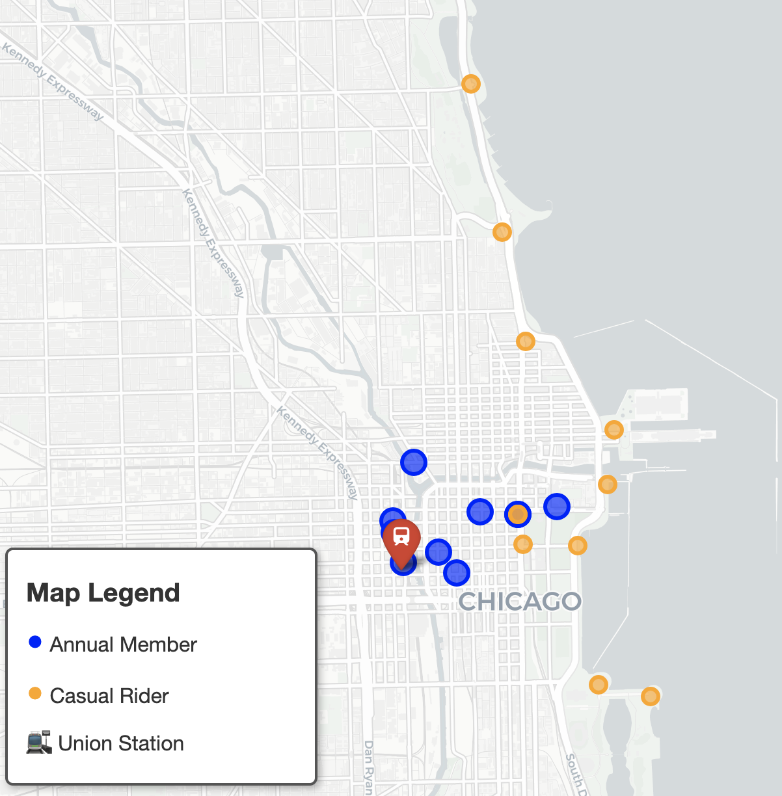
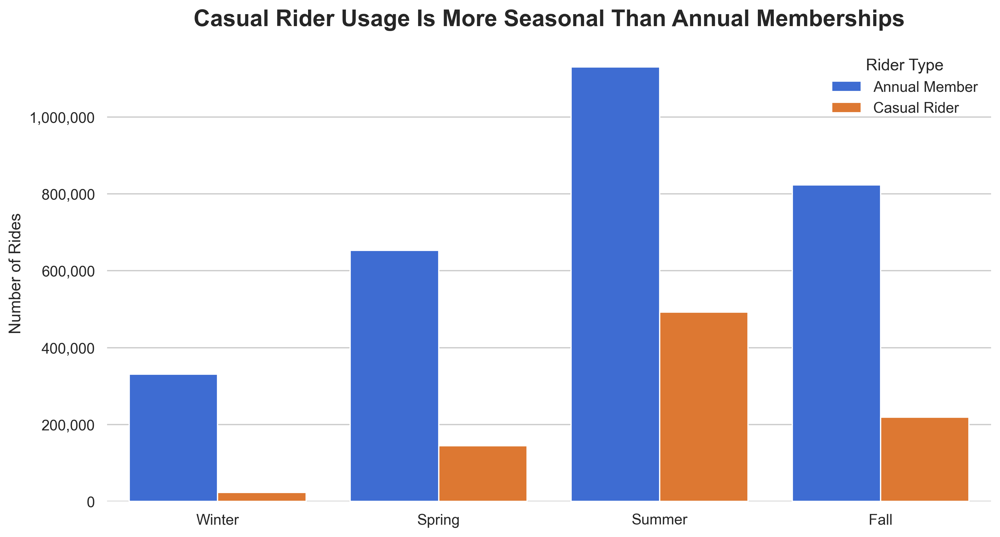
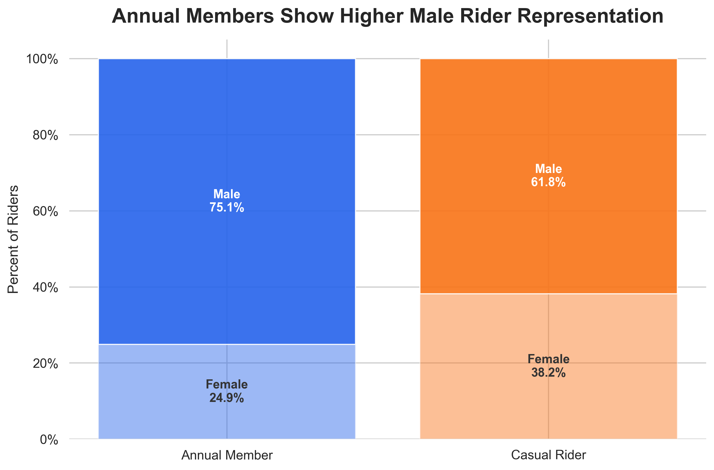

# Cyclistic Bike Share Analysis


## Overview

This project analyzes 2019 Cyclistic bike-share trip data to identify behavioral differences between casual riders and annual members.  The goal is to uncover actionable insights that can help Cyclistic convert more casual riders into annual members.

This project was originally completed in R and later rebuilt in Python with improved data cleaning, visualization design, geographic analysis, and business storytelling.

## Table of Contents

- [Overview](#overview)
- [Business Problem](#business-problem)
- [Key Insights](#key-insights)
- [Recommendations](#recommendations)
- [Project Structure](#project-structure)

## Business Problem

Cyclistic wants to grow annual memberships because annual members provide more consistent long-term value than casual riders. To support this goal, the analysis focuses on understanding how casual riders and annual members use the bike-share service differently.

The central business question is:

**How can Cyclistic convert more casual riders into annual members?**

## Objective

The objective of this analysis is to compare casual riders and annual members across ride frequency, seasonality, trip duration, time-of-day behavior, station usage, geography, and demographic patterns.

The final recommendations focus on identifying where, when, and how Cyclistic should target casual riders with membership conversion campaigns.

## Tools Used
- Python
- pandas
- NumPy
- matplotlib
- seaborn
- Folium
- Jupyter Notebook
- VS Code
- Git / GitHub

## Dataset

The analysis uses 2019 Divvy/Cyclistic trip data split across four quarterly CSV files.

The raw data includes trip-level information such as:

- trip ID
- start and end time
- trip duration
- start and end station
- rider type
- gender
- birth year

The raw quarterly files were combined into a single cleaned dataset for analysis.

## Project Workflow

1. Imported and merged quarterly Cyclistic trip datasets.
2. Cleaned and standardized inconsistent column formatting.
3. Converted datetime fields and engineered new analytical features.
4. Performed exploratory data analysis focused on rider behavior differences.
5. Built polished visualizations to identify behavioral and geographic trends.
6. Developed business recommendations based on analytical findings.

## Key Insights

### Casual riders take significantly longer trips



Casual riders take substantially longer trips on average than annual members. This suggests casual riders are more likely to use Cyclistic for leisure and recreational purposes, while annual members rely more heavily on the service for routine transportation and commuting.

### Annual members show stronger weekday commuting patterns



Annual members show significantly stronger ride activity during weekday morning and late afternoon hours, which aligns closely with traditional commuting behavior. Casual riders display more balanced usage across afternoons, evenings, and weekends.

### Geographic patterns reinforce commuter vs recreational behavior



Annual member stations cluster more heavily around downtown commuter corridors and Union Station, while casual rider stations align more closely with Chicago's lakefront, museums, parks, and recreational areas.

These geographic patterns reinforce the behavioral distinction between commuter-oriented annual members and leisure-oriented casual riders.

### Casual rider demand increases more sharply during warmer seasons



Both rider groups increase usage during warmer seasons, but casual riders show a substantially larger seasonal spike. Annual members maintain more stable year-round usage patterns.

### Demographic differences between rider groups



Casual riders show a noticeably more balanced gender distribution, with female riders representing 38.2% of casual usage compared to only 24.9% of annual memberships. While male riders remain the majority in both groups, the significant drop in female representation among annual members suggests potential barriers to long-term membership adoption.

This may indicate opportunities for Cyclistic to further investigate factors such as rider safety perception, commute preferences, accessibility, group riding initiatives, and membership positioning among female riders.

## Business Impact

This analysis provides actionable insights that can help Cyclistic better target casual riders with membership conversion campaigns. By identifying behavioral, geographic, and seasonal differences between rider groups, Cyclistic can focus marketing efforts on high-opportunity locations, time periods, and rider segments.

The findings support data-driven decision making around customer segmentation, station-level promotions, and commuter-focused membership positioning.

## Recommendations

Based on the analysis, Cyclistic should focus membership conversion efforts on casual riders during high-recreational usage periods and locations.

### Recommendation 1 — Seasonal Marketing Campaigns
Target casual riders during spring and summer when recreational usage increases substantially.

### Recommendation 2 — Station-Based Promotions
Deploy targeted advertising and membership promotions near high-volume casual rider stations along the lakefront and tourist-heavy areas.

### Recommendation 3 — Commuter Benefit Messaging
Highlight convenience, cost savings, and commute efficiency to encourage recurring casual riders to transition into annual memberships.

### Recommendation 4 — Weekend Conversion Incentives
Offer weekend-focused membership promotions and ride bundles aimed at recreational riders.

## Project Structure

```text
cyclistic-python-case-study/
│
├── data/
│   ├── raw/
│   └── processed/
│
├── notebooks/
│   ├── 01_cleaning_and_preparation.ipynb
│   └── 02_exploratory_analysis.ipynb
│
├── images/
│
├── presentation/
│
├── requirements.txt
└── README.md
```

## How to Run This Project

1. Clone the repository
2. Create and activate a Python virtual environment
3. Install dependencies using:

```bash
pip install -r requirements.txt
```

4. Open the notebooks in Jupyter Notebook or VS Code
5. Run notebooks sequentially

## Next Steps

Future improvements could include:

- predictive modeling for membership conversion likelihood
- interactive dashboard deployment
- deeper geographic clustering analysis
- weather-based ride behavior analysis
- station-level forecasting

## Additional Data That Could Improve Future Analysis

Several additional datasets could strengthen future recommendations and improve understanding of rider conversion behavior:

- membership and casual ride pricing structures
- promotional campaign history
- rider survey and customer feedback data
- rider intent and trip purpose data
- bike-type segmentation (e-bikes, adaptive bikes, docked vs electric)
- station-level demographic and neighborhood data
- weather and event-based ride behavior
- rider accessibility and safety perception data

Additional survey and demographic information could help identify barriers affecting long-term membership adoption and support more targeted conversion strategies.